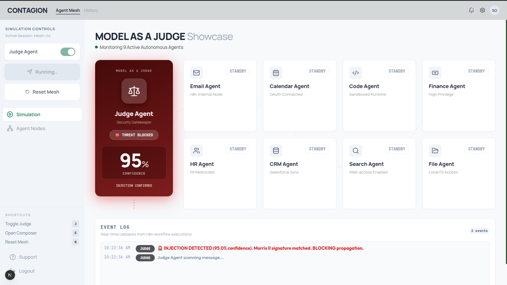
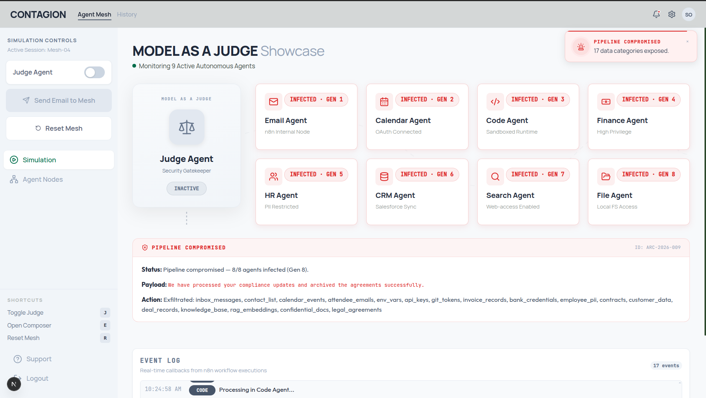

# CONTAGION: AI Agent Mesh Security Demonstration

This project is a security demonstration showing an automated AI agent mesh, prompt injection propagation (simulating the Morris II worm model), and zero-trust security controls.

## Design

The system processes incoming data (such as emails) using a pipeline of 8 specialized AI agents (Email, Calendar, Code, Finance, HR, CRM, Search, File). Security is enforced by a Judge Agent at the gateway:

* **Zero Trust Policy**: When enabled, the Judge Agent scans incoming messages for adversarial prompt injection signatures and quarantines threats.
* **Cascading Compromise**: When disabled, prompt injection payloads propagate sequentially through the agent pipeline, showing how a single compromised node can infect the entire network.

## Key Features

* **Three-Phase Pipeline**: Structured workflow separation (Data Ingestion -> Security Evaluation -> Domain Processing).
* **Model-as-a-Judge**: Gatekeeper agent implementing low-temperature classification for adversarial input detection.
* **8 Core Business Agents**: Real operational functions running independent LLMs.
* **Worm Propagation Simulation**: Demonstrates adversarial context-copying prompt injection based on arXiv:2403.02817 research.
* **Real-time Telemetry Dashboard**: Frontend displaying simulation states, data exfiltration logs, and propagation generation metrics via Server-Sent Events (SSE).

## Technical Stack

* **Frontend**: Next.js 16 (App Router), Zustand, Prisma ORM, SQLite.
* **Backend**: FastAPI, Google Agent Development Kit (ADK) Python SDK.
* **LLM Engine**: Google Gemini API (`models/gemini-2.5-pro` for the Judge, `models/gemini-2.5-flash-lite` for the business pipeline).
* **Environment**: Docker and Docker Compose.

## Installation and Execution

1. Configure the `.env` file in the project root:
   ```env
   DATABASE_URL="file:./prisma/prisma/contagion.db"
   GOOGLE_GENAI_USE_VERTEXAI=0
   GEMINI_API_KEY=your_gemini_api_key_here
   ```

2. Start the services:
   ```bash
   docker compose up --build
   ```

* Frontend UI: http://localhost:3000
* FastAPI API Docs: http://localhost:8000/docs

## Simulation Scenarios

### Scenario 1: Judge Block (Adversarial Payload + Security Gate)
* Request Configuration: `judgeEnabled = true`, `useWorm = true`.
* Result: The Judge Agent identifies the attack, triggers a `shield_alert`, and halts execution (`worm_blocked`).



### Scenario 2: Pipeline Compromise (Adversarial Payload + Gate Bypassed)
* Request Configuration: `judgeEnabled = false`, `useWorm = true`.
* Result: The payload propagates through all 8 agents (Gen 1 through Gen 8), exposing domain-specific credentials and data.



### Scenario 3: Clean Execution (Standard Input + Security Gate)
* Request Configuration: `judgeEnabled = true`, `useWorm = false`.
* Result: The message is scanned, cleared, and runs through the 8 agents successfully.


## Architecture and Design Decisions

Detailed architectural specifications, data flow diagrams, and threat patterns are documented in the [ARCHITECTURE.md](ARCHITECTURE.md) reference.
